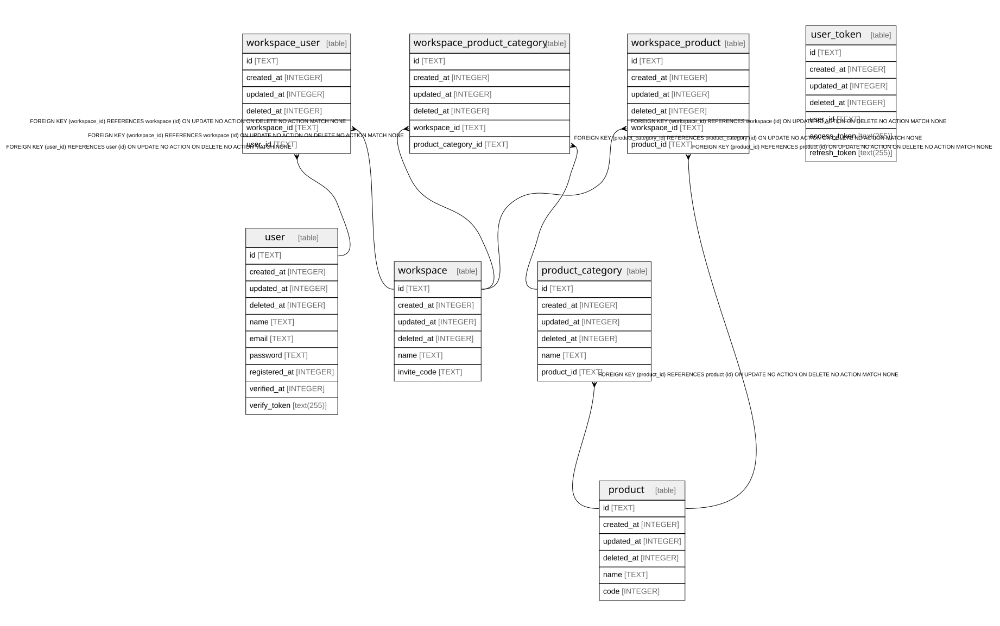

# schema.sqlite

## Tables

| Name | Columns | Comment | Type |
| ---- | ------- | ------- | ---- |
| [user](user.md) | 10 |  | table |
| [user_token](user_token.md) | 7 |  | table |
| [workspace](workspace.md) | 6 |  | table |
| [workspace_user](workspace_user.md) | 6 |  | table |
| [product](product.md) | 6 |  | table |
| [product_category](product_category.md) | 6 |  | table |
| [workspace_product](workspace_product.md) | 6 |  | table |
| [workspace_product_category](workspace_product_category.md) | 6 |  | table |

## Relations

---

> Generated by [tbls](https://github.com/k1LoW/tbls)
