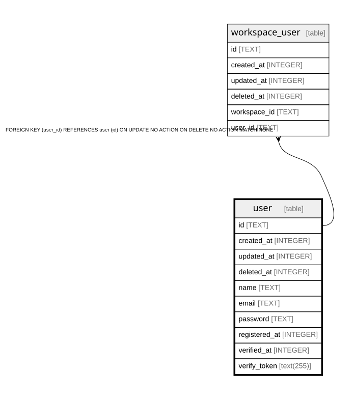

# user

## Description

<details>
<summary><strong>Table Definition</strong></summary>

```sql
CREATE TABLE `user` (
	`id` text PRIMARY KEY NOT NULL,
	`created_at` integer NOT NULL,
	`updated_at` integer NOT NULL,
	`deleted_at` integer,
	`name` text NOT NULL,
	`email` text NOT NULL,
	`password` text NOT NULL,
	`registered_at` integer NOT NULL,
	`verified_at` integer
, `verify_token` text(255) NOT NULL)
```

</details>

## Columns

| Name | Type | Default | Nullable | Children | Parents | Comment |
| ---- | ---- | ------- | -------- | -------- | ------- | ------- |
| id | TEXT |  | false | [workspace_user](workspace_user.md) |  |  |
| created_at | INTEGER |  | false |  |  |  |
| updated_at | INTEGER |  | false |  |  |  |
| deleted_at | INTEGER |  | true |  |  |  |
| name | TEXT |  | false |  |  |  |
| email | TEXT |  | false |  |  |  |
| password | TEXT |  | false |  |  |  |
| registered_at | INTEGER |  | false |  |  |  |
| verified_at | INTEGER |  | true |  |  |  |
| verify_token | text(255) |  | false |  |  |  |

## Constraints

| Name | Type | Definition |
| ---- | ---- | ---------- |
| id | PRIMARY KEY | PRIMARY KEY (id) |
| sqlite_autoindex_user_1 | PRIMARY KEY | PRIMARY KEY (id) |

## Indexes

| Name | Definition |
| ---- | ---------- |
| user_email_unique | CREATE UNIQUE INDEX `user_email_unique` ON `user` (`email`) |
| sqlite_autoindex_user_1 | PRIMARY KEY (id) |

## Relations



---

> Generated by [tbls](https://github.com/k1LoW/tbls)
