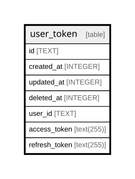

# user_token

## Description

<details>
<summary><strong>Table Definition</strong></summary>

```sql
CREATE TABLE `user_token` (
	`id` text PRIMARY KEY NOT NULL,
	`created_at` integer NOT NULL,
	`updated_at` integer NOT NULL,
	`deleted_at` integer,
	`user_id` text NOT NULL,
	`access_token` text(255) NOT NULL,
	`refresh_token` text(255) NOT NULL
)
```

</details>

## Columns

| Name | Type | Default | Nullable | Children | Parents | Comment |
| ---- | ---- | ------- | -------- | -------- | ------- | ------- |
| id | TEXT |  | false |  |  |  |
| created_at | INTEGER |  | false |  |  |  |
| updated_at | INTEGER |  | false |  |  |  |
| deleted_at | INTEGER |  | true |  |  |  |
| user_id | TEXT |  | false |  |  |  |
| access_token | text(255) |  | false |  |  |  |
| refresh_token | text(255) |  | false |  |  |  |

## Constraints

| Name | Type | Definition |
| ---- | ---- | ---------- |
| id | PRIMARY KEY | PRIMARY KEY (id) |
| sqlite_autoindex_user_token_1 | PRIMARY KEY | PRIMARY KEY (id) |

## Indexes

| Name | Definition |
| ---- | ---------- |
| sqlite_autoindex_user_token_1 | PRIMARY KEY (id) |

## Relations



---

> Generated by [tbls](https://github.com/k1LoW/tbls)
