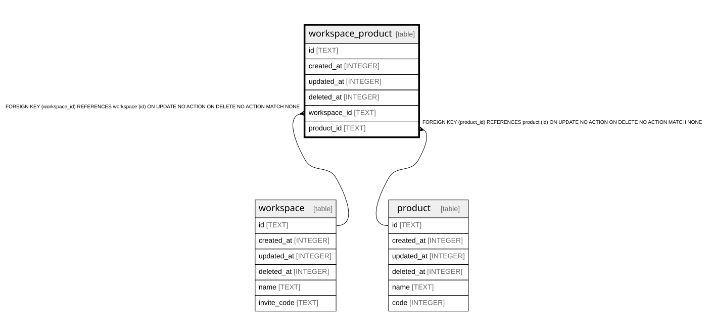

# workspace_product

## Description

<details>
<summary><strong>Table Definition</strong></summary>

```sql
CREATE TABLE `workspace_product` (
	`id` text PRIMARY KEY NOT NULL,
	`created_at` integer NOT NULL,
	`updated_at` integer NOT NULL,
	`deleted_at` integer,
	`workspace_id` text NOT NULL,
	`product_id` text NOT NULL,
	FOREIGN KEY (`workspace_id`) REFERENCES `workspace`(`id`) ON UPDATE no action ON DELETE no action,
	FOREIGN KEY (`product_id`) REFERENCES `product`(`id`) ON UPDATE no action ON DELETE no action
)
```

</details>

## Columns

| Name | Type | Default | Nullable | Children | Parents | Comment |
| ---- | ---- | ------- | -------- | -------- | ------- | ------- |
| id | TEXT |  | false |  |  |  |
| created_at | INTEGER |  | false |  |  |  |
| updated_at | INTEGER |  | false |  |  |  |
| deleted_at | INTEGER |  | true |  |  |  |
| workspace_id | TEXT |  | false |  | [workspace](workspace.md) |  |
| product_id | TEXT |  | false |  | [product](product.md) |  |

## Constraints

| Name | Type | Definition |
| ---- | ---- | ---------- |
| id | PRIMARY KEY | PRIMARY KEY (id) |
| - (Foreign key ID: 0) | FOREIGN KEY | FOREIGN KEY (product_id) REFERENCES product (id) ON UPDATE NO ACTION ON DELETE NO ACTION MATCH NONE |
| - (Foreign key ID: 1) | FOREIGN KEY | FOREIGN KEY (workspace_id) REFERENCES workspace (id) ON UPDATE NO ACTION ON DELETE NO ACTION MATCH NONE |
| sqlite_autoindex_workspace_product_1 | PRIMARY KEY | PRIMARY KEY (id) |

## Indexes

| Name | Definition |
| ---- | ---------- |
| sqlite_autoindex_workspace_product_1 | PRIMARY KEY (id) |

## Relations



---

> Generated by [tbls](https://github.com/k1LoW/tbls)
